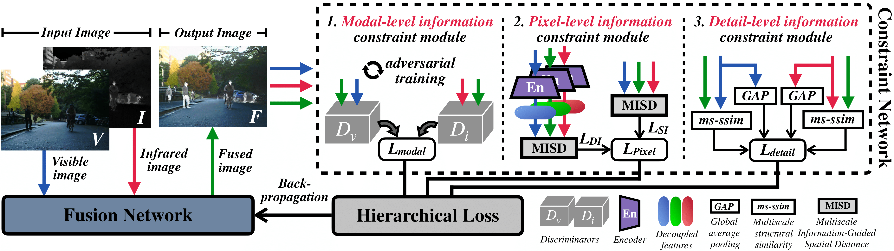

# HiFusion
The official code of [*"HiFusion: An Unsupervised Infrared and Visible Image Fusion Framework With a Hierarchical Loss Function"*](https://ieeexplore.ieee.org/document/10912736)
> 📝 Published in: IEEE Transactions on Instrumentation and Measurement (TIM), 2025  
> 🧑‍💻 Author: [Kaicheng Xu](https://github.com/Kylesesa), An Wei, Congxuan Zhang, Zhen Chen, Ke Lu, Weiming Hu, and Feng Lu.


## Overview

<p align="center">
  
</p>

## Environment

```latex
Python = 3.7.16
PyTorch = 1.11.0
torchvision = 0.12.0
numpy = 1.19.5，
matplotlib = 3.5.3
opencv-python = 4.8.0.76
```
Please make sure all dependencies are installed. If certain packages are missing, please install them manually. If you are unable to set up the environment successfully, please contact me.

## Train 

## Test

## Citation

```latex
@ARTICLE{xu2025hifusion,
  author={Xu, Kaicheng and Wei, An and Zhang, Congxuan and Chen, Zhen and Lu, Ke and Hu, Weiming and Lu, Feng},
  journal={IEEE Transactions on Instrumentation and Measurement}, 
  title={HiFusion: An Unsupervised Infrared and Visible Image Fusion Framework With a Hierarchical Loss Function}, 
  year={2025},
  volume={74},
  number={},
  pages={1-16},
  keywords={Training;Feature extraction;Loss measurement;Image fusion;Electronic mail;Generative adversarial networks;Data mining;Visualization;Visual perception;Usability;End-to-end;hierarchical loss function;image fusion;infrared and visible images;unsupervised learning},
  doi={10.1109/TIM.2025.3548202}}
```
K. Xu et al., "HiFusion: An Unsupervised Infrared and Visible Image Fusion Framework With a Hierarchical Loss Function," in IEEE Transactions on Instrumentation and Measurement, vol. 74, pp. 1-16, 2025, Art no. 5015616, doi: 10.1109/TIM.2025.3548202.


